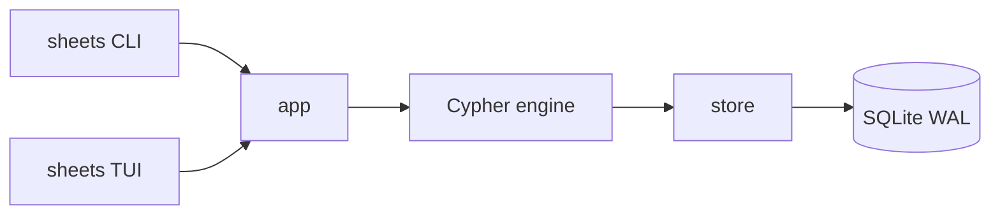

# sheets

Graph storage for agents. One binary, one SQLite file, no server.

[](https://github.com/svlocks/sheets/actions/workflows/ci.yml)
[](go.mod)

sheets is a temporal property graph. You write Cypher against it, everything
lands in a single SQLite file, and every write creates a new revision instead
of clobbering the last one. So you can read the graph as it looked five
minutes ago, or at revision 42, or at a specific wall-clock time. No daemons,
no config files, no migrations to babysit.

## Install

```sh
go install github.com/svlocks/sheets/cmd/sheets@latest
```

## Quick start

```sh
sheets init
sheets exec --message "seed" '
  CREATE (a:Task {title: "ship it"})-[:CHILD]->(b:Task {title: "write tests"})
  RETURN a, b
'
sheets query 'MATCH (n:Task) RETURN n.title'
```

`sheets init` drops a `.sheets` folder in the current directory. That folder
is the entire database.


## How it fits together



The CLI and the TUI are two frontends over the same engine. There are no
privileged operations; anything the TUI does, you can also do in Cypher.

## Time travel

Every write bumps the revision counter. Nothing is ever overwritten, so any
past state is still reachable:

```sh
sheets history
sheets query --at-revision 3 'MATCH (n) RETURN n'
sheets query --at-time "2026-09-01T10:00:00Z" 'MATCH (n) RETURN n'
```

## Features

- **Concurrent and daemonless.** Processes share the database over SQLite WAL. No socket, no lockfile, no sync service.
- **Cypher for reads and writes.** M23-derived, one language both ways.
- **Built-in TUI.** `sheets tui` for browsing and editing without leaving the terminal.
- **Machine-readable output.** Table, JSON, or streaming JSONL.

## Commands

| Command | Does |
| --- | --- |
| `sheets init` | Create a project in the current directory |
| `sheets exec` | Run Cypher reads and writes atomically |
| `sheets query` | Run a read-only query |
| `sheets history` | List revisions |
| `sheets status` | Node and relationship counts |
| `sheets tui` | Open the terminal UI |

## Docs

- [CLI reference](docs/cli.md)
- [Cypher dialect](docs/cypher.md)
- [TUI guide](docs/tui.md)
- [Architecture](docs/architecture.md)
- [Benchmarks](docs/performance.md)
- [Contributing](CONTRIBUTING.md)
